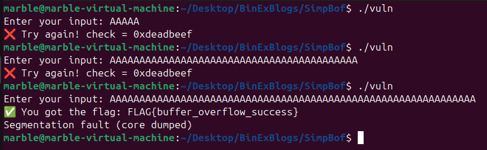
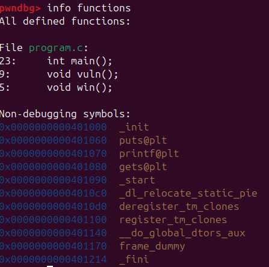
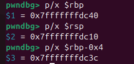
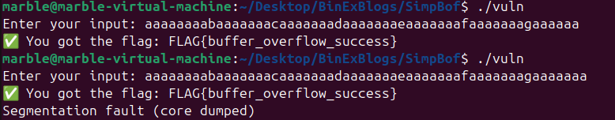

In previous posts we looked what are buffer overflows, how they work and how we can find the offset (number of bytes) need to overflow.
Today we'll do this in a practical example:

# Simple Vulnerable Program
Here's a simple program in `C` language.This Program is vulnerable to Buffer Overflow.
```C
#include <stdio.h>
#include <string.h>
#include <stdlib.h>

void win() {
    printf("✅ You got the flag: FLAG{buffer_overflow_success}\n");
}

void vuln() {
    char buffer[40];
    int check = 0xdeadbeef;

    printf("Enter your input: ");
    gets(buffer);  // ❌ unsafe, vulnerable to overflow

    if (check != 0xdeadbeef) {
        win();
    } else {
        printf("❌ Try again! check = 0x%x\n", check);
    }
}

int main() {
    vuln();
    return 0;
}
```
## Compile
Compile the binary using following command
```
gcc -g -fno-stack-protector -z execstack -no-pie vulnerable.c -o vuln
```
Flags explained:
- -g → include debug symbols (for GDB)
- -fno-stack-protector → disables stack canaries
- -z execstack → allows execution from the stack (useful for later shellcode stuff)
- -no-pie → makes addresses static (no ASLR within binary)

will discuss more about the flags in later posts.

## Why vulnerable?
The given program is vulnerable because it uses `gets()` function to get the user input. The `gets` function has no bound and it can read infinite number of bytes unless terminated by a null byte `0`.
So, Basically given program is working in the following way
1. It asks the user for input.
2. Uses `gets` to read the user input.
3. Buffer is of 40 bytes, but what if user enter more than 40 bytes?
4. The next variable `check` in the stack gets overwritten.
5. The value of `check` is compared with the original value. If its not equal we go to win function and gets the flag.
6. Simple, right? Now lets look it from hackers/pwners pov when we don't have the actual source code of the binary.

# Running the Binary
Let's first run the binary and send different inputs to see how it behaves.

Here are two cases:
1. When the input is normal, we don't get the flag.
2. When the input is greater than 40 bytes we get the flag.

Also, note that after getting the flag there's `segmentation fault`. This means that the program can't figure out where to return to `basically EIP is corrupted due to corrupted stack`. So, it just crashed and showed this error.

# Using GDB
I have installed [pwndbg](https://github.com/pwndbg/pwndbg). It makes things easier.
Now lets run the binary in GDB.
```
gdb ./vuln
```
Next we view all functions present in binary using
```
info functions
```

The interesting functions are `vuln` and `win`
Lets add a breakpoint on `vuln` function and run the binary.
```
b vuln
run
```

Now lets disassemble the vuln function to see what it looks like

```bash
pwndbg> disass vuln
Dump of assembler code for function vuln:
   0x0000000000401190 <+0>:	endbr64
   0x0000000000401194 <+4>:	push   rbp
   0x0000000000401195 <+5>:	mov    rbp,rsp
   0x0000000000401198 <+8>:	sub    rsp,0x30
=> 0x000000000040119c <+12>:	mov    DWORD PTR [rbp-0x4],0xdeadbeef
   0x00000000004011a3 <+19>:	lea    rax,[rip+0xe92]        # 0x40203c
   0x00000000004011aa <+26>:	mov    rdi,rax
   0x00000000004011ad <+29>:	mov    eax,0x0
   0x00000000004011b2 <+34>:	call   0x401070 <printf@plt>
   0x00000000004011b7 <+39>:	lea    rax,[rbp-0x30]
   0x00000000004011bb <+43>:	mov    rdi,rax
   0x00000000004011be <+46>:	mov    eax,0x0
   0x00000000004011c3 <+51>:	call   0x401080 <gets@plt>
   0x00000000004011c8 <+56>:	cmp    DWORD PTR [rbp-0x4],0xdeadbeef
   0x00000000004011cf <+63>:	je     0x4011dd <vuln+77>
   0x00000000004011d1 <+65>:	mov    eax,0x0
   0x00000000004011d6 <+70>:	call   0x401176 <win>
   0x00000000004011db <+75>:	jmp    0x4011f6 <vuln+102>
   0x00000000004011dd <+77>:	mov    eax,DWORD PTR [rbp-0x4]
   0x00000000004011e0 <+80>:	mov    esi,eax
   0x00000000004011e2 <+82>:	lea    rax,[rip+0xe66]        # 0x40204f
   0x00000000004011e9 <+89>:	mov    rdi,rax
   0x00000000004011ec <+92>:	mov    eax,0x0
   0x00000000004011f1 <+97>:	call   0x401070 <printf@plt>
   0x00000000004011f6 <+102>:	nop
   0x00000000004011f7 <+103>:	leave
   0x00000000004011f8 <+104>:	ret
End of assembler dump.
```

- Here we can see that in function prologue, the stack pointer `rsp` gets subtracted by `0x30`. This means that there is a space of 0x30 created on stack for this function (this includes all the variables in the function and some other alignments etc)

- In the next instruction `0xdeadbeef` is moved into the memory address of `[rbp-0x4]`

- Lets see what is the values of `rsp` `rbp` and `rbp-0x4`.



we can see that 
- `rsp` is pointing to `dc10`
- `rbp` is pointing to `dc40`
- `rbp-0x4` is pointing to `dc3c`
- return address is `rbp + 0x8`

This means that
- There is `0x30` space between `rbp` and `rsp`
- The space between local variable and `rsp` is `c40 - c10` = `0x30` or `48 bytes`
- This means that sending `48 (stack) + 8 saved ebp = 56 bytes` will result in overwriting the saved return address in stack and we'll crash.
- Let's confirm this



- when sending 55 bytes we get the flag.
- when sending 56 bytes, the program crashed.

We will look into return stuff more in detail when we hijack the return using overflow.